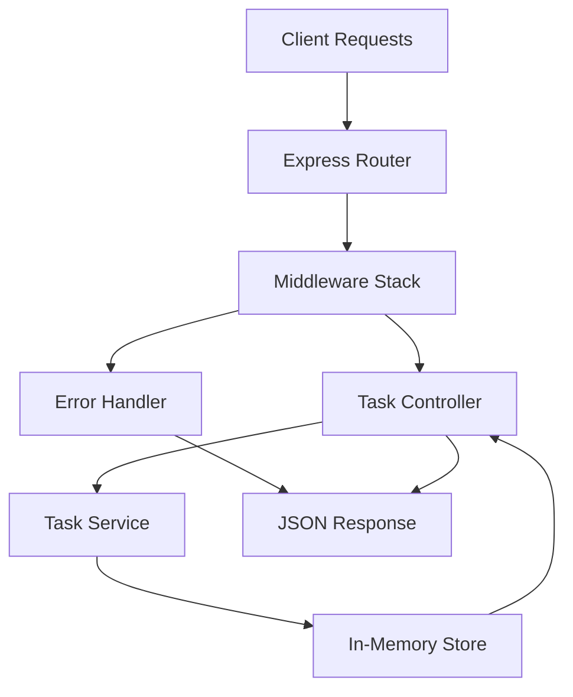

# Implementation Plan: simple-express-api

## Specification Reference
- **Spec ID**: SPEC-001
- **Generated**: 2025-10-05
- **Optimization Focus**: Simplicity and performance

## Architecture Overview


## Phase -1: Pre-Implementation Gates
**SDD Compliance Check** - Must pass before coding:
- [x] Specification First - Complete spec with no ambiguities
- [x] Incremental Planning - Phases clearly defined
- [x] Task Decomposition - Tasks are concrete and executable
- [x] Quality Assurance - Testing strategy defined
- [x] Architecture Documentation - Technical decisions recorded

## Phase 0: Foundation
### Objectives
- Set up Express.js project structure
- Configure development environment
- Initialize core middleware and routing

### Tasks
- [ ] Initialize Node.js project with package.json
- [ ] Install Express.js and dependencies (express, morgan, cors, helmet)
- [ ] Create basic server structure with app.js
- [ ] Set up middleware stack (logging, CORS, error handling)
- [ ] Configure environment variables for port and settings
- [ ] Create basic health check endpoint

### Success Criteria
- Development environment operational
- Server starts successfully on configured port
- Health check endpoint returns 200 OK
- Basic middleware logging requests to console

## Phase 1: Core Implementation
### Objectives
- Implement task management functionality
- Create RESTful endpoints for CRUD operations
- Establish data validation and error handling

### Tasks
- [ ] Create Task model with validation (id, title, description, status, timestamps)
- [ ] Implement in-memory data store with array operations
- [ ] Build task controller with CRUD methods
- [ ] Create /tasks routes with Express Router
- [ ] Implement input validation middleware
- [ ] Add comprehensive error handling
- [ ] Create consistent JSON response format

### Success Criteria
- All CRUD endpoints working (GET, POST, PUT, DELETE /tasks)
- Task validation prevents invalid data
- Error responses follow consistent format
- UUID generation for new tasks
- Timestamp management (createdAt, updatedAt)

## Phase 2: Enhancement
### Objectives
- Add advanced features and robustness
- Improve API usability and security
- Optimize performance

### Tasks
- [ ] Implement pagination for GET /tasks endpoint
- [ ] Add task filtering by status
- [ ] Implement search functionality for tasks
- [ ] Add request rate limiting middleware
- [ ] Enhance security with Helmet middleware
- [ ] Add API documentation with Swagger/OpenAPI
- [ ] Implement task status workflow validation

### Success Criteria
- Pagination works efficiently with large task lists
- Status filtering returns correct subsets
- Search finds tasks by title/description
- Rate limiting prevents abuse
- Security headers properly configured
- API documentation accessible and accurate

## Phase 3: Polish & Deploy
### Objectives
- Comprehensive testing and validation
- Production readiness and deployment
- Performance optimization

### Tasks
- [ ] Write comprehensive unit tests for all endpoints
- [ ] Create integration tests for complete workflows
- [ ] Add performance testing and load testing
- [ ] Create Docker configuration for deployment
- [ ] Set up environment-specific configurations
- [ ] Create deployment documentation
- [ ] Add monitoring and health check endpoints

### Success Criteria
- All tests passing with >90% code coverage
- Performance targets met (<200ms response time)
- Docker container builds and runs successfully
- Documentation complete and accurate
- Production deployment successful

## Technical Decisions

### Architecture Pattern
- **Pattern**: Layered Architecture (Controller → Service → Store)
- **Rationale**: Simple, maintainable, and appropriate for the scope

### Technology Stack
- **Backend**: Express.js 4.18.2 with Node.js 16.x
- **Data Storage**: In-memory array store (for simplicity)
- **Testing**: Jest for unit tests, Supertest for API testing
- **Documentation**: Swagger/OpenAPI 3.0
- **Deployment**: Docker containerization

### Key Design Decisions
1. **In-Memory Storage**: Chosen for simplicity and demonstration purposes. Can be easily replaced with database later.
2. **UUID Generation**: Using crypto module for reliable unique IDs
3. **Middleware Stack**: Morgan for logging, CORS for cross-origin, Helmet for security
4. **Error Handling**: Centralized error middleware with consistent JSON responses
5. **Validation**: Manual validation for simplicity, can upgrade to Joi/Yup later

## Risk Management

### Identified Risks
1. **Risk**: Memory leak with in-memory storage
   - **Probability**: Medium
   - **Impact**: Medium
   - **Mitigation**: Implement data cleanup, monitoring, and easy database migration path

2. **Risk**: Poor error handling exposes sensitive information
   - **Probability**: Low
   - **Impact**: High
   - **Mitigation**: Sanitize error messages, log securely, use generic error responses

3. **Risk**: API performance under load
   - **Probability**: Medium
   - **Impact**: Medium
   - **Mitigation**: Rate limiting, monitoring, performance testing

4. **Risk**: Data loss on server restart
   - **Probability**: High
   - **Impact**: Medium
   - **Mitigation**: Document limitation, provide persistence upgrade path

## Resource Requirements
- **Team Size**: 1-2 developers
- **Timeline**: 2-3 weeks for full implementation
- **Budget**: Minimal (open-source dependencies)
- **Tools**: Node.js, Git, Docker, testing frameworks

## Dependencies
- **Runtime**: Node.js 16.x or later
- **Core Libraries**: Express.js, Morgan, CORS, Helmet
- **Development**: Nodemon, Jest, Supertest, ESLint
- **Optional**: Swagger UI for API documentation
- **Infrastructure**: Docker for containerization

## Monitoring & Success Metrics
- **Performance Metrics**: Response time <200ms, throughput >100 req/sec
- **Business Metrics**: API usage statistics, error rates <1%
- **Quality Metrics**: Code coverage >90%, zero critical vulnerabilities
- **Operational Metrics**: Uptime >99%, successful deployments

## Implementation Notes
### Project Structure
```
simple-express-api/
├── src/
│   ├── controllers/
│   │   └── taskController.js
│   ├── services/
│   │   └── taskService.js
│   ├── models/
│   │   └── task.js
│   ├── middleware/
│   │   ├── validation.js
│   │   ├── errorHandler.js
│   │   └── rateLimit.js
│   ├── routes/
│   │   └── tasks.js
│   └── utils/
│       └── logger.js
├── tests/
│   ├── unit/
│   └── integration/
├── docs/
│   └── api/
├── app.js
├── package.json
└── Dockerfile
```

### API Response Format Standards
```javascript
// Success Response
{
  "success": true,
  "data": { /* task object or array */ },
  "message": "Operation completed successfully",
  "timestamp": "2025-10-05T11:30:00.000Z"
}

// Error Response
{
  "success": false,
  "error": {
    "code": "VALIDATION_ERROR",
    "message": "Invalid input data",
    "details": { /* specific validation errors */ }
  },
  "timestamp": "2025-10-05T11:30:00.000Z"
}
```

### Future Enhancement Opportunities
- Database persistence (MongoDB/PostgreSQL)
- Authentication and authorization (JWT/OAuth)
- Real-time updates (WebSocket)
- Caching layer (Redis)
- API versioning
- GraphQL endpoint
- Microservices decomposition