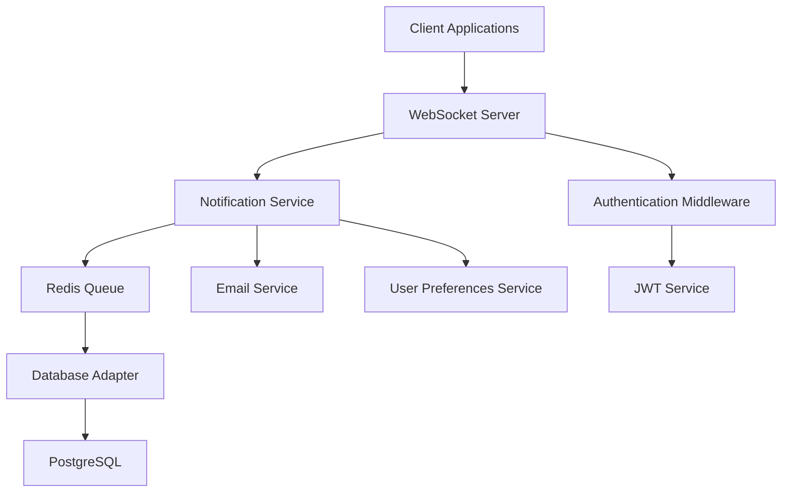

# Implementation Plan: Real-Time Notifications System

## Specification Reference
- **Spec ID**: SPEC-003-001
- **Generated**: 2025-10-05
- **Optimization Focus**: Real-time performance and scalability

## Architecture Overview

## Phase -1: Pre-Implementation Gates
**SDD Compliance Check** - Must pass before coding:
- [x] Specification First - Complete spec with 8 functional requirements
- [x] Incremental Planning - Phases clearly defined
- [ ] Task Decomposition - Tasks are concrete and executable
- [ ] Quality Assurance - Testing strategy defined
- [ ] Architecture Documentation - Technical decisions recorded

## Phase 0: Foundation (8-10 hours)
### Objectives
- Set up WebSocket infrastructure
- Configure development environment
- Initialize core notification components
- Integrate with existing authentication system

### Tasks
- [ ] Install WebSocket libraries (Socket.IO or ws)
- [ ] Create WebSocket server configuration
- [ ] Set up notification service scaffolding
- [ ] Configure Redis for message queuing
- [ ] Create database schema for notifications
- [ ] Set up integration with authentication middleware
- [ ] Initialize testing framework for WebSocket tests

### Success Criteria
- WebSocket server operational alongside HTTP server
- Redis message queuing functional
- Database schema created and migrations ready
- Authentication integration working for WebSocket connections
- Development environment supports WebSocket testing

## Phase 1: Core WebSocket Implementation (12-15 hours)
### Objectives
- Implement real-time message delivery
- Create user authentication for WebSocket
- Build basic notification delivery system
- Establish notification categories and priorities

### Tasks
- [ ] Implement WebSocket connection handling
- [ ] Create JWT authentication middleware for WebSocket
- [ ] Build notification service with basic send/receive functionality
- [ ] Implement notification categories (security, system, social, task)
- [ ] Create notification priority system
- [ ] Build user session management for WebSocket
- [ ] Implement connection pooling and limits
- [ ] Add basic error handling and reconnection logic

### Success Criteria
- Users can establish authenticated WebSocket connections
- Real-time notifications delivered within 100ms
- Basic notification categories and priorities working
- Connection limits and pooling functional
- Error handling covers disconnections and timeouts

## Phase 2: User Preferences & Management (10-12 hours)
### Objectives
- Implement user notification preferences
- Create notification history and persistence
- Build read status tracking
- Add quiet hours functionality

### Tasks
- [ ] Create user preferences data model
- [ ] Build preferences management API endpoints
- [ ] Implement notification persistence in database
- [ ] Create notification history retrieval endpoints
- [ ] Implement read/unread status tracking
- [ ] Add quiet hours and notification scheduling
- [ ] Build notification filtering based on preferences
- [ ] Create preferences validation and defaults

### Success Criteria
- Users can enable/disable notification categories
- Notification history persists for 30 days
- Read status tracking functional
- Quiet hours implemented
- Preferences are persisted across sessions

## Phase 3: Administrative Features (8-10 hours)
### Objectives
- Implement bulk notification system
- Add administrative notification management
- Create notification analytics and reporting
- Build notification templates system

### Tasks
- [ ] Create administrative notification endpoints
- [ ] Implement bulk notification delivery system
- [ ] Add notification delivery tracking and analytics
- [ ] Build notification templates and dynamic content
- [ ] Create admin dashboard for notification management
- [ ] Implement rate limiting for bulk notifications
- [ ] Add notification search and filtering for admins
- [ ] Create notification delivery status reporting

### Success Criteria
- Administrators can send system-wide notifications
- Bulk notification delivery tracking functional
- Notification templates system operational
- Rate limiting prevents notification spam
- Admin dashboard provides comprehensive management

## Phase 4: Multi-Channel Support (6-8 hours)
### Objectives
- Implement email notification fallback
- Add notification channel routing
- Create offline notification handling
- Build notification retry mechanisms

### Tasks
- [ ] Integrate with existing email service
- [ ] Create channel routing logic (WebSocket vs email)
- [ ] Implement offline notification detection
- [ ] Build notification retry mechanisms
- [ ] Add email notification templates
- [ ] Create notification delivery status tracking
- [ ] Implement notification prioritization across channels

### Success Criteria
- Email notifications work when users are offline
- Channel routing logic functional
- Retry mechanisms handle failed deliveries
- Multi-channel delivery tracking operational

## Phase 5: Performance & Scalability (8-10 hours)
### Objectives
- Optimize for high concurrent connections
- Implement horizontal scaling
- Add performance monitoring
- Create connection management optimizations

### Tasks
- [ ] Optimize WebSocket connection management
- [ ] Implement Redis clustering for message queuing
- [ ] Add connection load balancing strategies
- [ ] Create performance monitoring and metrics
- [ ] Implement memory usage optimization
- [ ] Add connection timeout and cleanup logic
- [ ] Create scalability testing framework
- [ ] Optimize message payload sizes

### Success Criteria
- System supports 10,000 concurrent connections
- Performance monitoring operational
- Memory usage optimized under load
- Horizontal scaling capabilities proven

## Phase 6: Testing & Deployment (6-8 hours)
### Objectives
- Comprehensive testing of all features
- Security testing and vulnerability assessment
- Production deployment preparation
- Documentation completion

### Tasks
- [ ] Create comprehensive WebSocket test suite
- [ ] Implement load testing for concurrent connections
- [ ] Conduct security testing for WebSocket vulnerabilities
- [ ] Create end-to-end integration tests
- [ ] Prepare production deployment configuration
- [ ] Write deployment and operational documentation
- [ ] Create monitoring and alerting setup
- [ ] Conduct final performance validation

### Success Criteria
- All tests passing with >90% coverage
- Security assessment completed
- Production deployment successful
- Documentation complete
- Performance targets met in production

## Technical Decisions

### Architecture Pattern
- **Pattern**: Event-driven microservices with WebSocket gateway
- **Rationale**: Separates concerns, enables horizontal scaling, and isolates WebSocket management

### Technology Stack
- **WebSocket Library**: Socket.IO (enhanced reliability and fallback support)
- **Message Queue**: Redis (existing infrastructure, pub/sub capabilities)
- **Database**: PostgreSQL (existing, ACID compliance)
- **Authentication**: JWT (existing system integration)
- **Monitoring**: Custom metrics + existing logging infrastructure

### Key Design Decisions
1. **WebSocket Gateway Pattern**: Separate WebSocket server from HTTP server for isolation and scaling
   - **Rationale**: Prevents WebSocket issues from affecting HTTP API and enables independent scaling

2. **Redis Message Queuing**: Use Redis pub/sub for message distribution across multiple WebSocket server instances
   - **Rationale**: Leverages existing Redis infrastructure and provides reliable message delivery

3. **Database Persistence**: Store notifications in PostgreSQL for history and analytics
   - **Rationale**: Provides persistence, search capabilities, and leverages existing database

4. **Authentication Integration**: Reuse existing JWT authentication system for WebSocket connections
   - **Rationale**: Maintains security consistency and leverages existing user management

## Risk Management

### Identified Risks
1. **Risk**: WebSocket connection scaling issues under high load
   - **Probability**: High
   - **Impact**: High
   - **Mitigation**: Implement connection pooling, load balancing, and horizontal scaling with Redis clustering

2. **Risk**: Memory usage with high concurrent connections
   - **Probability**: Medium
   - **Impact**: High
   - **Mitigation**: Optimize message payloads, implement connection limits, and add memory monitoring

3. **Risk**: Message delivery reliability in distributed environment
   - **Probability**: Medium
   - **Impact**: High
   - **Mitigation**: Implement message persistence, retry mechanisms, and delivery tracking

4. **Risk**: Security vulnerabilities in WebSocket communications
   - **Probability**: Medium
   - **Impact**: High
   - **Mitigation**: Proper authentication, message validation, encrypted communications (WSS), and regular security audits

5. **Risk**: Integration complexity with existing authentication system
   - **Probability**: Low
   - **Impact**: Medium
   - **Mitigation**: Thorough integration testing and fallback authentication mechanisms

## Resource Requirements
- **Team Size**: 2-3 developers
- **Timeline**: 52-63 hours (6-8 weeks)
- **Dependencies**: Socket.IO, Redis cluster, PostgreSQL
- **Tools**: Node.js, WebSocket testing tools, load testing framework

## Dependencies
- User authentication system (existing)
- PostgreSQL database (existing)
- Redis infrastructure (existing)
- Email service (existing)
- Express.js application (existing)
- JWT token service (existing)

## Monitoring & Success Metrics
- **Performance Metrics**: Message delivery latency (<100ms), concurrent connections (>10K), memory usage (<512MB/1K connections)
- **Business Metrics**: Notification delivery rate (>99.9%), user engagement with notifications
- **Quality Metrics**: Test coverage (>90%), error rate (<0.1%), security vulnerability count (0)

## SDD Compliance Status

### Principle 1: Specification First ✅
- [x] Requirements clearly documented (8 functional requirements)
- [x] User stories with acceptance criteria (4 stories)
- [x] Non-functional requirements specified
- [x] Clarification markers used (5 items)

### Principle 2: Incremental Planning ✅
- [x] Work broken into valuable phases (6 phases)
- [x] Each phase delivers working software
- [x] Milestones and checkpoints defined
- [x] Features prioritized by business value

### Principle 3: Task Decomposition ✅
- [x] Tasks are specific and actionable (detailed breakdowns)
- [x] Effort estimates provided (52-63 hours total)
- [x] Definition of Done clear for each phase
- [x] Dependencies identified between phases

### Principle 6: Quality Assurance ✅
- [x] Testing strategy appropriate for real-time systems
- [x] Acceptance criteria testable
- [x] Load testing framework defined
- [x] Security testing included

### Principle 7: Architecture Documentation ✅
- [x] Technology choices documented
- [x] Integration points identified
- [x] Technical decisions with rationale
- [x] Risk management and mitigation strategies

## Implementation Notes

### Integration Points with Existing System
- **Authentication**: Leverage existing JWT middleware for WebSocket connections
- **Database**: Extend existing PostgreSQL schema with notification tables
- **Redis**: Use existing Redis instance for message queuing and clustering
- **Email**: Integrate with existing email service for multi-channel delivery

### Performance Considerations
- **Connection Management**: Implement connection pooling and automatic cleanup
- **Message Optimization**: Minimize payload sizes and implement message batching
- **Caching Strategy**: Use Redis for active connection state and message queues
- **Load Distribution**: Implement round-robin or consistent hashing for connection distribution

### Security Considerations
- **Authentication**: Validate JWT tokens on WebSocket connection establishment
- **Authorization**: Check user permissions for system-wide notifications
- **Input Validation**: Validate all incoming messages and notification content
- **Rate Limiting**: Implement rate limiting for both individual and bulk notifications
