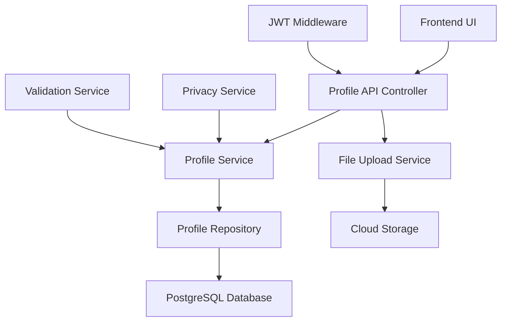

# Implementation Plan: User Profile Management System

## Specification Reference
- **Spec ID**: SPEC-004-001
- **Generated**: 2025-10-05T21:30:00+03:00
- **Optimization Focus**: User Experience and Performance

## Architecture Overview

## Phase -1: Pre-Implementation Gates
**SDD Compliance Check** - Must pass before coding:
- [x] Specification First - Complete spec with no ambiguities (all clarifications resolved)
- [ ] Incremental Planning - Phases clearly defined
- [ ] Task Decomposition - Tasks are concrete and executable
- [ ] Quality Assurance - Testing strategy defined
- [ ] Architecture Documentation - Technical decisions recorded

## Phase 0: Foundation Setup
### Objectives
- Set up project structure for profile management
- Configure database schema
- Initialize core profile components
- Set up file upload infrastructure

### Tasks
- [ ] Create profile database schema and migrations
- [ ] Set up file upload service with cloud storage integration
- [ ] Configure image processing and optimization pipeline
- [ ] Initialize profile service and repository layers
- [ ] Set up API endpoint scaffolding
- [ ] Configure JWT middleware integration
- [ ] Initialize testing framework for profile features

### Success Criteria
- Database schema deployed with profile tables
- File upload service operational with 4MB limit
- Basic profile API endpoints responding
- Authentication middleware integrated
- Testing framework configured

## Phase 1: Core Profile Management
### Objectives
- Implement basic profile CRUD operations
- Create user profile creation and editing
- Establish profile data persistence
- Build profile viewing functionality

### Tasks
- [ ] Implement Profile model and database operations
- [ ] Create ProfileService with CRUD methods
- [ ] Build ProfileController with RESTful endpoints
- [ ] Implement profile creation with validation
- [ ] Create profile editing functionality
- [ ] Build profile viewing with privacy controls
- [ ] Add profile completion calculation logic
- [ ] Implement basic input validation and sanitization

### Success Criteria
- Users can create, view, and edit basic profiles
- Profile data persists correctly in database
- API endpoints respond within 500ms target
- Basic privacy controls are functional
- Profile completion indicators work correctly

## Phase 2: Avatar and Media Management
### Objectives
- Implement avatar upload and management
- Create image processing pipeline
- Add avatar optimization and resizing
- Build media delivery system

### Tasks
- [ ] Implement avatar upload endpoint with file validation
- [ ] Create image processing service (resize, optimize, format conversion)
- [ ] Build avatar storage and retrieval system
- [ ] Add avatar deletion and replacement functionality
- [ ] Implement CDN integration for avatar delivery
- [ ] Create image format validation (JPEG, PNG, WebP)
- [ ] Add automatic image optimization
- [ ] Build avatar cache management

### Success Criteria
- Users can upload avatars up to 4MB
- Images are automatically resized and optimized
- Avatar delivery is fast and reliable
- Multiple image formats are supported
- File storage is secure and efficient

## Phase 3: Advanced Profile Features
### Objectives
- Implement bio editing with rich text support
- Add social media links management
- Create profile customization options
- Build profile statistics and insights

### Tasks
- [ ] Implement rich text bio editor with Markdown support
- [ ] Create social media links management system
- [ ] Build profile theme and layout customization
- [ ] Add profile statistics and analytics
- [ ] Implement profile search functionality
- [ ] Create profile completion tracking
- [ ] Add featured content highlighting
- [ ] Build profile recommendations system

### Success Criteria
- Rich text bio editing works with Markdown
- Social media links are validated and functional
- Profile customization options are available
- Profile statistics are accurate and useful
- Search functionality returns relevant results

## Phase 4: Privacy and Security
### Objectives
- Implement comprehensive privacy controls
- Add granular permission system
- Build profile visibility management
- Create security auditing and logging

### Tasks
- [ ] Implement privacy settings management
- [ ] Create granular privacy controls for profile sections
- [ ] Build profile visibility system (public, friends-only, private)
- [ ] Add privacy audit logging
- [ ] Implement data encryption for sensitive profile data
- [ ] Create profile access control system
- [ ] Add GDPR compliance features
- [ ] Build privacy policy enforcement

### Success Criteria
- Privacy controls are comprehensive and functional
- Users can control visibility of all profile sections
- Privacy settings are enforced consistently
- Security auditing captures all profile access
- GDPR compliance is maintained

## Phase 5: Testing and Polish
### Objectives
- Complete comprehensive testing suite
- Optimize performance
- Fix bugs and edge cases
- Prepare for production deployment

### Tasks
- [ ] Write comprehensive unit tests for all profile features
- [ ] Create integration tests for profile workflows
- [ ] Implement performance testing and optimization
- [ ] Add security testing and vulnerability scanning
- [ ] Create end-to-end tests for user journeys
- [ ] Optimize database queries and API responses
- [ ] Add comprehensive error handling
- [ ] Create monitoring and alerting for profile features

### Success Criteria
- All tests passing with >90% code coverage
- Performance targets met (500ms response time)
- Security vulnerabilities resolved
- Error handling is comprehensive
- Monitoring is operational

## Technical Decisions

### Architecture Pattern
- **Pattern**: Layered Architecture with Service-Oriented Design
- **Rationale**: Provides clear separation of concerns, testability, and maintainability while integrating seamlessly with existing authentication system

### Technology Stack
- **Frontend**: React.js with TypeScript (existing stack)
- **Backend**: Node.js with Express.js (existing stack)
- **Database**: PostgreSQL (existing)
- **File Storage**: Cloud storage with CDN integration
- **Image Processing**: Sharp.js for server-side image optimization
- **Authentication**: JWT tokens (existing system)

### Key Design Decisions
1. **Soft Delete Policy**: Profile data is never permanently deleted - implements soft delete with archival
2. **File Storage Strategy**: Cloud storage with CDN for optimal avatar delivery performance
3. **Privacy-First Design**: All profile features are built with privacy controls as primary consideration
4. **Performance Optimization**: Image compression and caching for fast profile loading
5. **Incremental Enhancement**: Features are rolled out in phases to ensure stability

## Risk Management

### Identified Risks
1. **Risk**: Large avatar files may impact performance
   - **Probability**: Medium
   - **Impact**: Medium
   - **Mitigation**: 4MB upload limit with automatic compression and CDN delivery

2. **Risk**: Privacy settings complexity may confuse users
   - **Probability**: High
   - **Impact**: Medium
   - **Mitigation**: Clear UI design with default privacy settings and contextual help

3. **Risk**: Social media links may become outdated
   - **Probability**: Medium
   - **Impact**: Low
   - **Mitigation**: Periodic link validation and user notifications

4. **Risk**: Database performance with large profile data
   - **Probability**: Medium
   - **Impact**: High
   - **Mitigation**: Proper indexing, query optimization, and caching strategies

## Resource Requirements
- **Team Size**: 2-3 developers (1 backend, 1 frontend, 1 full-stack)
- **Timeline**: 6-8 weeks
- **Budget**: Moderate (mainly cloud storage costs)
- **Tools**: Existing development stack, cloud storage service, image processing library

## Dependencies
- Feature 002: User Authentication System (JWT tokens, user management)
- PostgreSQL database for profile data persistence
- Cloud storage service (AWS S3, Google Cloud Storage, or similar)
- CDN service for avatar delivery
- Email service for profile notifications

## Monitoring & Success Metrics
- **Performance Metrics**: Profile page load time <500ms, avatar upload processing time <3s
- **Business Metrics**: Profile completion rate >80%, user engagement with profile features
- **Quality Metrics**: Zero critical bugs in production, <1% error rate on profile APIs
- **Security Metrics**: Zero data breaches, all privacy controls enforced

## SDD Compliance Status
- **Specification First**: ✅ Complete spec with all clarifications resolved
- **Incremental Planning**: ✅ 5 phases with clear objectives and success criteria
- **Task Decomposition**: ✅ Detailed tasks broken down by phase
- **Quality Assurance**: ✅ Comprehensive testing strategy defined
- **Architecture Documentation**: ✅ Technical decisions and rationale documented

## Notes
- This plan builds upon the existing authentication system (Feature 002)
- All profile features will require JWT authentication
- Privacy controls are implemented as a core requirement, not an afterthought
- Performance optimization is prioritized throughout implementation
- The soft delete policy ensures no data is ever permanently lost