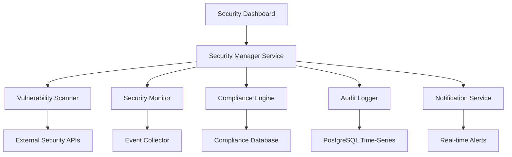

# Implementation Plan: Security Audit System

## Specification Reference
- **Spec ID**: SPEC-005
- **Generated**: 2025-10-05T23:20:00+03:00
- **Optimization Focus**: Security performance and real-time monitoring

## Architecture Overview

## Phase -1: Pre-Implementation Gates
**SDD Compliance Check** - Must pass before coding:
- [x] Specification First - Complete spec with no ambiguities
- [ ] Incremental Planning - Phases clearly defined
- [ ] Task Decomposition - Tasks are concrete and executable
- [ ] Quality Assurance - Testing strategy defined
- [ ] Architecture Documentation - Technical decisions recorded

## Phase 0: Foundation & Security Infrastructure
### Objectives
- Set up security-focused project structure
- Configure security monitoring environment
- Initialize core security components
- Set up secure development practices

### Tasks
- [ ] Create security service project scaffolding
- [ ] Set up security dependencies (OWASP, Winston, Helmet)
- [ ] Configure secure build system with security scanning
- [ ] Initialize security testing framework with penetration testing tools
- [ ] Set up security event logging infrastructure
- [ ] Configure secure database connections with encryption

### Success Criteria
- Secure development environment operational
- Security scanning integrated into CI/CD pipeline
- Security logging framework functional
- Team trained on security development practices

## Phase 1: Core Security Components
### Objectives
- Implement vulnerability scanning engine
- Create real-time security monitoring
- Establish audit trail management
- Build security incident reporting

### Tasks
- [ ] Implement vulnerability scanner with OWASP Dependency-Check
- [ ] Create security event collector and processor
- [ ] Build tamper-proof audit logging system
- [ ] Develop security incident classification engine
- [ ] Create security metrics calculation service
- [ ] Implement security alert generation system

### Success Criteria
- Vulnerability scanning operational with scheduled scans
- Real-time security monitoring detecting suspicious activities
- Audit trails captured with integrity verification
- Security incidents properly classified and reported

## Phase 2: Advanced Security Features
### Objectives
- Implement compliance management system
- Build security configuration management
- Add advanced threat detection
- Create security analytics dashboard

### Tasks
- [ ] Implement GDPR and SOC 2 compliance engine
- [ ] Build security policy management system
- [ ] Create advanced anomaly detection algorithms
- [ ] Develop comprehensive security dashboard
- [ ] Implement security report generation system
- [ ] Create security metrics and KPI tracking

### Success Criteria
- Compliance dashboards showing regulatory adherence
- Security policies enforced across infrastructure
- Advanced threats detected with machine learning
- Comprehensive security analytics available

## Phase 3: Integration & Optimization
### Objectives
- Integrate with existing authentication and notification systems
- Optimize security performance and resource usage
- Complete security testing and validation
- Deploy with comprehensive security monitoring

### Tasks
- [ ] Integrate with user authentication system (002)
- [ ] Connect to real-time notification system (003)
- [ ] Optimize security scanning performance and scheduling
- [ ] Complete security penetration testing
- [ ] Finalize security documentation and runbooks
- [ ] Deploy with comprehensive security monitoring

### Success Criteria
- Seamless integration with existing systems
- Security performance optimized for production load
- All security tests passing including penetration tests
- Production deployment with full security monitoring

## Technical Decisions

### Architecture Pattern
- **Pattern**: Microservices with Security-First Design
- **Rationale**: Security isolation, independent scaling, specialized security services

### Technology Stack
- **Backend**: Node.js with Express.js + Security middleware
- **Database**: PostgreSQL with time-series extensions for audit logs
- **Cache**: Redis for security event processing and alert queuing
- **Security Libraries**: OWASP Dependency-Check, Helmet, Winston, Node-cron
- **External APIs**: Snyk API, Nessus Scanner API, OWASP feeds
- **Monitoring**: Custom security metrics + existing monitoring infrastructure

### Key Design Decisions
1. **Tamper-Proof Logging**: All audit logs are cryptographically signed and stored in append-only time-series database
2. **Real-time Processing**: Security events processed through Redis streams for sub-second detection
3. **Compliance-First Design**: All features designed with GDPR and security compliance as primary requirements
4. **Integration Strategy**: Security system enhances existing services without performance impact
5. **Alert Prioritization**: Machine learning-based alert correlation to reduce false positives

### Security Considerations
- **Data Encryption**: All sensitive data encrypted at rest and in transit
- **Access Control**: Role-based access control with audit trails
- **Network Security**: Security services isolated in separate network segments
- **Secrets Management**: Secure key management for all security operations
- **Compliance**: GDPR compliance with data minimization and right to deletion

## Risk Management

### Identified Risks
1. **Risk**: Performance impact on main application
   - **Probability**: Medium
   - **Impact**: High
   - **Mitigation**: Asynchronous processing, dedicated security infrastructure, performance monitoring

2. **Risk**: False positive security alerts
   - **Probability**: High
   - **Impact**: Medium
   - **Mitigation**: Machine learning correlation, configurable thresholds, manual review processes

3. **Risk**: Data privacy concerns with audit logs
   - **Probability**: Medium
   - **Impact**: High
   - **Mitigation**: Data encryption, minimal data collection, GDPR compliance, data retention policies

4. **Risk**: Integration complexity with existing systems
   - **Probability**: Medium
   - **Impact**: Medium
   - **Mitigation**: Phased implementation, comprehensive testing, fallback mechanisms, API versioning

5. **Risk**: Security system vulnerabilities
   - **Probability**: Low
   - **Impact**: Critical
   - **Mitigation**: Security code reviews, penetration testing, dependency scanning, secure coding practices

## Resource Requirements
- **Team Size**: 3-4 security-focused developers
- **Timeline**: 8-10 weeks
- **Security Expertise**: Required (application security, compliance, threat detection)
- **External Tools**: Snyk license, Nessus scanner, security training budget
- **Infrastructure**: Dedicated security monitoring environment

## Dependencies
- **Internal Services**: User Authentication (002), Real-time Notifications (003)
- **External Services**: Snyk API, Nessus Scanner API, OWASP security feeds
- **Security Libraries**: OWASP Dependency-Check, Helmet, Winston, Node-cron
- **Infrastructure**: PostgreSQL with time-series extensions, Redis clusters
- **Compliance**: GDPR requirements, security standards documentation

## Monitoring & Success Metrics
- **Security Metrics**: Vulnerability count, mean time to detection (MTTD), mean time to response (MTTR)
- **Compliance Metrics**: GDPR compliance score, security policy adherence percentage
- **Performance Metrics**: Security scan duration, alert processing time, system resource usage
- **Business Metrics**: Security incident reduction, audit completion time, compliance audit success rate
- **Quality Metrics**: False positive rate, security test coverage, penetration test results

## Implementation Notes
- Security system designed to be non-intrusive to existing application performance
- All security events logged with immutable audit trails for compliance
- Real-time monitoring with configurable alert thresholds to prevent alert fatigue
- Regular security scanning integrated into CI/CD pipeline for continuous security
- Compliance reporting automated for audits and regulatory requirements
- Security policies enforced through code and infrastructure as code
- Emergency response procedures documented and regularly tested